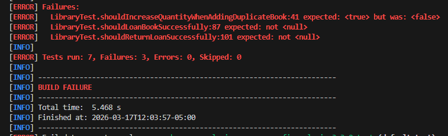
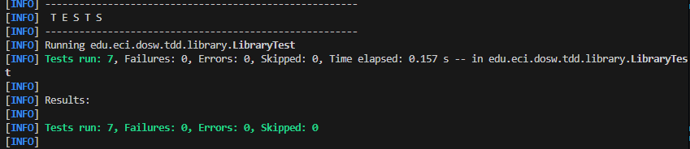
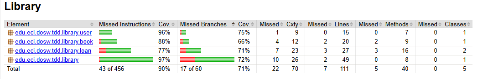

# Laboratorio 6 - TDD, Cobertura y Análisis Estático

## Integrantes

* Daniel Ahumada
* Camilo Torres
* Roger Duran
* Camilo León
* Juan Neira


## Descripción General
Este laboratorio se centra en la aplicación de Test-Driven Development (TDD) como práctica fundamental para estructurar proyectos de software. Se desarrolló un sistema básico de gestión de bibliotecas con entidades como Book, User, Loan y Library.

## Objetivos
- Aplicar TDD en el desarrollo de funcionalidades
- Implementar pruebas unitarias con JUnit 5
- Medir la cobertura del código con JaCoCo
- Realizar análisis estático con SonarQube

## Estructura del Proyecto
El proyecto fue construido con Maven y Java 17, siguiendo una organización por paquetes:
- `library.book`
- `library.user`
- `library.loan`
- `library`

Cada paquete cuenta con su respectivo conjunto de pruebas.

## Implementación
Se copiaron las principales funcionalidades en la clase `Library`:
- Agregar libros al sistema
- Registrar usuarios
- Prestar libros con validaciones
- Devolver libros y actualizar su estado

Se aplicó TDD escribiendo primero las pruebas unitarias para los métodos:
- `addBook`
- `loanABook`
- `returnLoan`

## Pruebas
Se utilizó JUnit 5 para crear pruebas unitarias que validan:
- Funcionamiento correcto en casos normales
- Casos límite como libros no disponibles o usuarios inexistentes
- Restricciones como evitar préstamos duplicados

primeramente probamos los tests, para ver como funcionaba; entonces al aplicar el comando

```
mvn test
```



Y pues ya despues realizamos el respectivo codigo, para que las pruebas pasaran



## Cobertura
Se integró JaCoCo para medir la cobertura del código. Se configuró un mínimo del 80% de cobertura para asegurar la calidad del software.

El reporte de cobertura se genera en:

```
target/site/jacoco/index.html
```

y lo sacamos usando el comando

```
mvn clean verify
```

vimos que con los test que habiamos hecho, nos genero un coverage inferior a 80%, pero agregamos mas pruebas para subir ese coverage, quedamos con el siguiente reporte:




## Análisis Estático
Se utilizó SonarQube para analizar la calidad del código:
- Identificación de code smells
- Detección de bugs potenciales
- Validación de cobertura de pruebas

La integración se realizó mediante Maven usando el plugin de Sonar.


## Ejecución
Para compilar el proyecto: